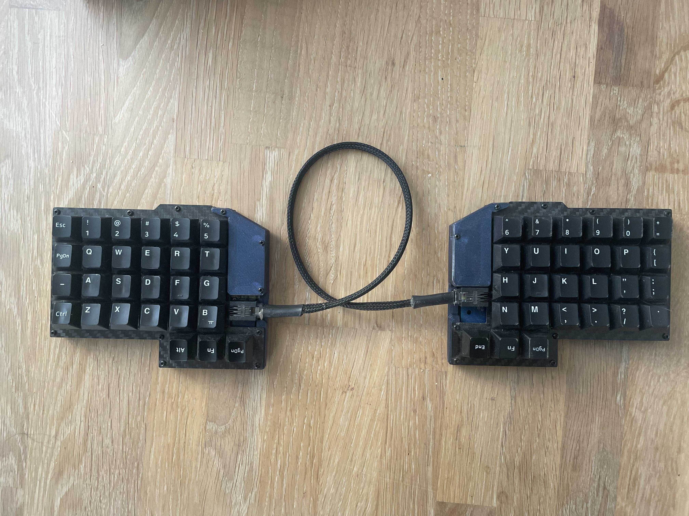
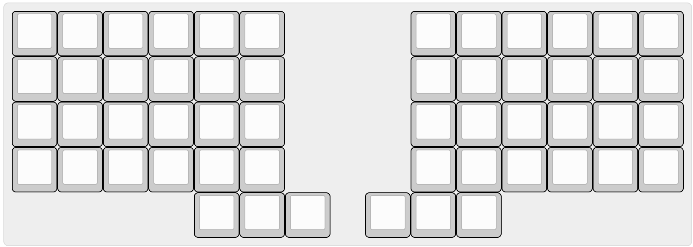
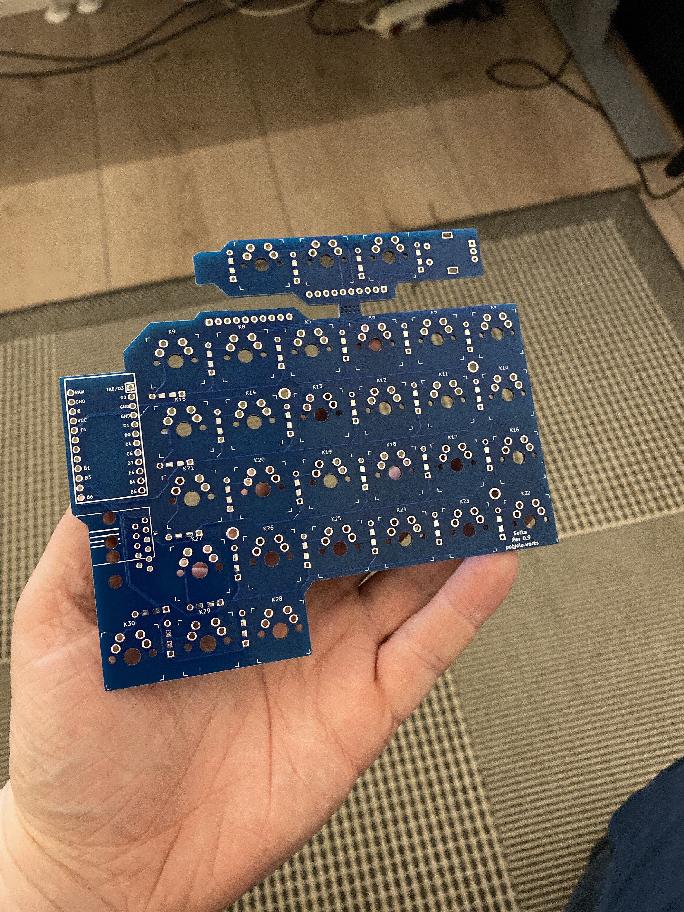

# Sotka

Split mechanical keyboard with orthogonal layout and detachable extra row

Uses an RJ12 cable for serial communication between the halves.

### Basic layout without extra row

### Reversible PCB with extra row
